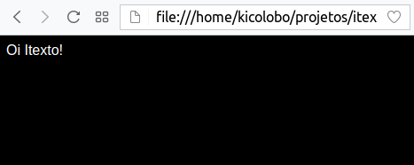
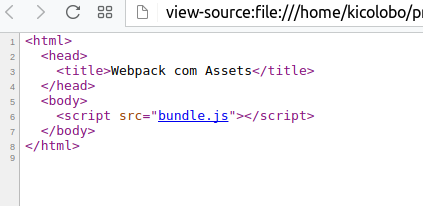
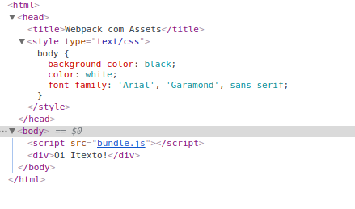
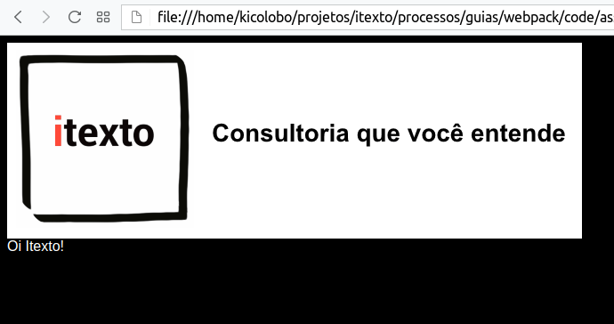
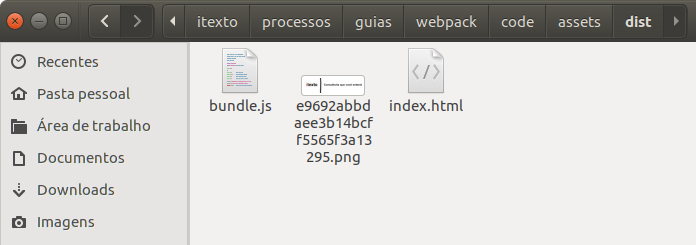

= Usando o Webpack
Henrique Lobo Weissmann <kico@itexto.com.br>
:doctype: book
:revnumber: 1.0
:revdate: 23/6/2017
:revremark: Primeira edição
:description: Guia de Webpack da itexto
:front-cover-image: 
:toc:
:toc-title: Índice
:footer: itexto Consultoria - http://www.itexto.com.br

:homepage: http://www.itexto.com.br

== Sobre a itexto

Somos uma empresa de consultoria com foco no desenvolvimento de software sediada em Belo Horizonte que desenvolve sistemas de altíssima qualidade além de ajudarmos nossos clientes na execução desta tarefa através da nossa consultoria.

Atuamos nas seguintes frentes:

Treinamentos para empresas:: Ajudamos a sua empresa a dominar as tecnologias nas quais somos referência como, por exemplo, Groovy, Grails, Spring, Java EE
Treinamentos para desenvolvedores independentes:: Através da http://formacao.itexto.com.br[Formação itexto] oferecemos treinamentos voltados para desenvolvedores independentes nas tecnologias que dominamos.
Consultoria:: Projeto e crítica arquitetural, suporte a equipes de desenvolvimento e auxílio de aquisição
Desenvolvimento de sistemas customizados:: Atuamos no projeto, construção e implantação de soluções customizadas para nossos clientes
Evolução de sistemas legados:: Extraímos máximo valor da infraestrutura que nossos clientes já possuem

Atuamos em projetos tanto no Brasil quanto no exterior nas mais variadas áreas: financeira, comércio eletrônico, mineração, saúde, startups, produtos alimentícios, engenharia, tecnologia da informação, educação e pesquisa.

Além disto também somos muito ativos na comunidade de desenvolvimento de software a partir de algumas das nossas iniciativas:

http://www.groovybrasil.com.br[Groovy & Grails Brasil]:: uma das maiores comunidades do mundo de desenvolvedores que usam a linguagem Groovy e tecnologias relacionadas.
http://www.springbrasil.com.br[Spring Brasil]:: nosso último projeto, consiste em um fórum voltado para desenvolvedores que trabalhem com o ecossistema Spring.
http://devall.com.br[/dev/All]:: nosso agragador de blogs de desenvolvedores
http://devkico.itexto.com.br[/dev/Kico]:: blog do nosso co-fundador, Henrique Lobo Weissmann (autor deste guia), que é considerado uma das principais referências sobre Groovy & Grails no Brasil
http://formacao.itexto.com.br[Formação itexto]:: aonde ministramos nossos treinamentos para desenvolvedores independentes nas tecnologias em que somos referência

Você pode entrar em contato conosco através do nosso site (http://www.itexto.com.br), telefone (31 2555-1979) ou e-mail (contato@itexto.com.br).

<<<<<

== Introdução

Webpack é um `module bundler`, isto é, uma ferramenta de `build` responsável por compilar/agregar/processar conteúdos como JavaScript, HTML, CSS, fontes, imagens e outros em uma única unidade de código (o bundle).

Posteriormente, este guia será aprimorado e liberado para o grande público.

=== Como ler este guia

Há uma boa razão pela qual este guia se chama "guia": meu objetivo aqui é lhe guiar (no sentido de "direcionar") por um caminho que tenha como destino o conhecimento mínimo a respeito do modo como você deve usar o Webpack.

É fato conhecido que o conhecimento é construído em camadas. Por esta razão a primeira parte do guia é focada nos conceitos por trás do Webpack. Esta leitura nos proporcionará o vocabulário mínimo para que possamos prosseguir com as seções práticas.

Terminada a leitura conceitual vamos para a parte prática da leitura. Primeiro com exemplos bastante simples (lidando apenas com JavaScript) para, depois, vermos na prática como lidar com outros tipos de conteúdo. Para obter máximo aproveitamento, sugiro que tenha instalados os requisitos de sotware acima mencionados e que, no momento em que estiver realizando esta leitura, experimente por conta própria os códigos que são fornecidos com o guia.

Finalmente, após duas práticas básicas iremos começar a exposição de usos específicos do Webpack focados em problemas práticos que tenhamos encontrado em nosso dia a dia. O objetivo é que você não perca tempo com os problemas que enfrentamos no caminho.

Lembre-se: este é um guia *essencial*. Sendo assim não espere grande aprofundamento no que aqui será exposto. Nosso objetivo é apenas lhe fornecer uma base para que posteriormente, caso seja de seu interesse (ou necessidade), seja possível um real mergulho nas funcionalidades do Webpack.

==== Requisitos de software

Tenha instalado o Node.js em seu computador. Este já virá com o gerenciador de pacotes npm. Caso não venha, será necessário instalá-lo separadamente.

(A propósito, a Itexto tem um guia sobre o NPM que você pode achar útil)

Este guia é escrito levando-se em consideração os sistemas operacionais Linux e MacOS. Entretanto não haverá grandes mudanças caso você esteja usando Windows. Caso a demanda por maiores detalhes sobre como usar o Webpack neste sistema operacional seja significativa, prometo lançar uma nova edição deste guia contemplando esta plataforma.

O uso do Linux e Mac OS baseia-se apenas no fato de serem os sistemas operacionais usados internamente pela Itexto no desenvolvimento de seus projetos.

=== Como obter o código fonte

O código fonte deste guia pode ser acessado pelo Github do eBook no seguinte endereço: https://github.com/itexto/guia_webpack

A propósito, todos os guias da Itexto tem seu código fonte aberto. Sendo assim, caso encontre algum erro ou tenha sugestões de inclusão, pode me escrever! kico@itexto.com.br 

=== Agradecimento

Este guia surgiu dos estudos internos que realizei com Italo Daldegan (aqui da Itexto) a respeito do ferramental adotado no desenvolvimento de projetos frontend com tecnologias HTML 5. Sendo assim, agradeço ao Italo por ter me aguentado durante este processo e, também, pelo trabalho de revisão realizado neste trabalho.

<<<<

== Conceitual

Nosso primeiro passo consiste em entender o quê vêm a ser o Webpack, o que faremos através da análise dos conceitos fundamentais que envolvem seu funcionamento.

Então, o que é o `Webpack`? Pense neste como esencialmente uma ferramenta de construção (`build`), tal como o Make (C, C++), Maven ou Gradle (Java). Seu papel fundamental é gerar uma unidade de código auto contida, o que é feito através das seguintes etapas:

* Obtenção de dependências.
* Possível compilação e otimização.
* Junção das dependências e código intermediário em uma unidade de código auto contida (o bundle).

Seu papel portanto, de uma forma bem simples é a de "criar bundles". Entenderemos o que é um bundle, assim como os conceitos relacionados nesta seção do guia.

Link original para consulta: https://webpack.js.org/concepts/

=== Bundle

Unidade de código construída a partir de um grafo de dependências. Pense no bundle como uma "unidade de compilação", tal como ocorre em um programa tradicional que compilamos usando C ou Java.

Este "programa" possui, como qualquer outro, dois componentes fundamentais:

* O seu "código fonte".
* Outros códigos fonte do qual precisa para funcionar.

Este segundo elemento, chamamos de `dependência`, ou seja, um conteúdo necessário para que nosso bundle possa ser usado. O trabalho do Webpack é obter todas estas dependências, uni-las em uma unidade de código e, na sequência, mesclá-la com o "código fonte" do nosso programa própriamente dito.

Este conjunto de dependências também tem um nome: *grafo de dependências*. Como cada dependência, por si só, pode também requerer outras dependências, forma-se um grafo.

E estas "dependências da dependência" também possuem um nome neste jargão: *dependência transitiva". Vamos a um exemplo rápido:

Imagine que nosso `bundle` possua uma única dependência, que chamaremos de "A". E que esta dependência - "A" - possua, por sua vez, três `dependências transitivas`: "B", "C", "D".

O trabalho do Webpack consistirá em gerar um único bundle (arquivo), composto pelos seguintes elementos:

* O código fonte do nosso programa.
* A dependência "A"
* As dependências transitivas "B", "C", "D".

Tudo isto com algumas vantagens:

* O bundle já é construído de tal forma que os arquivos são carregados na ordem correta, evitando um erro muito comum durante o desenvolvimento.
* Podem ser realizadas otimizações no código final do bundle, tais como minificações, ofuscamentos ou mesmo remoção de código desnecessário.
* É gerado um único arquivo, o que *pode* melhorar o desempenho da aplicação ou ao menos a impressão de melhoria para o usuário final do projeto.

Sendo assim, após esta "breve" descrição, podemos finalmente chegar a uma definição mais precisa: _"é uma unidade de código auto contida"_, isto é, em um único arquivo temos tudo o que precisamos para que nossa funcionalidade execute tal como esperado, sem a necessidade de precisarmos ficar carregando mais de um arquivo para obter o mesmo resultado.

=== Entry point

Ponto de entrada a partir do qual instruimos o Webpack a buscar todos os elementos que serão usados na construção de um bundle. O Webpack precisa saber por onde começar, este é o ponto.

Neste arquivo encontra-se normalmente as principais dependências diretas e, não raro, o próprio código que escrevemos para o nosso bundle. Você verá a criaçãod e um ponto de entrada em nossa primeira prática.

=== Output

O arquivo final (bundle) gerado pelo Webpack.

=== Loader

Por padrão o Webpack só lida com arquivos JavaScript. Entretanto, ele também pode lidar com outros conteúdos, tais como CSS, imagens, arquivos do Vue.js, etc.

O componente de software responsável por expandir a capacidade do Webpack é o 'Loader`.

=== Plugins

O Webpack é extendido através de plugins, que permitem, dentre outras coisas:

* Interceptar eventos de compilação.
* Executar scripts usando a infraestrustura do Webpack.
* Incrementar as funcionalidades do Webpack, tornando-o uma ferramenta de build completa.

<<<<<

== Nosso primeiro projeto baseado em Webpack

Vamos começar com um exemplo bastante simples baseado na seção `Getting Started` da documentação do Webpack (https://webpack.js.org/guides/getting-started/). É essencialmente o mesmo conteúdo do link, só que com nossos comentários para que possamos explicar os detalhes referentes à execução do projeto.

O código fonte final pode ser acessado na pasta `code/inicio` que acompanha este guia.

==== Criação do projeto

Apenas execute estes comandos:

....
mkdir inicio
cd inicio
npm init -y
....

Três passos simples. No primeiro criamos o diretório que conterá nosso projeto, no segundo mudamos o diretório corrente da interface de linha de comandos e, finalmente, criamos um novo projeto baseado em npm.

O parâmetro `-y` é uma mera comodidade: sua função é pular todo o questionamento realizado quando criamos um projeto baseado em npm. O resultado final da execução dos comandos acima será uma estrutura de diretórios tal como a exposta a seguir:

....
+ [inicio]
|- package.json (arquivo do npm)
....

==== Instalando o Webpack no projeto

Como toda ferramenta baseada em Node.js, há duas formas de se instalar o Webpack: local ou globalmente. De acordo com a documentação oficial (https://webpack.js.org/guides/installation/#local-installation), entretanto, a forma recomendada de se instalar o Webpack é a local.

Isto por que você pode ter diferentes versões do Webpack no seu ambiente de trabalho, e talvez a global não seja a ideal para o projeto corrente.

Se mesmo após este aviso você quiser instalar globalmente o Webpack (o que, como ficará claro mais a frente, é inteiramente desnecessário), basta executar o comando a seguir:

....
npm install -g webpack
....

Agora vamos instalar o Webpack da maneira recomendada que é localmente. Execute o comando a seguir estando no diretório do projeto criado:

....
npm install --save-dev webpack
....

A opção `--save-dev` incluirá a dependência no arquivo `package.json` do NPM no ambiente de desenvolvimento, excluindo-a do resultado final de produção (você não precisa (nem deve) incluir o Webpack no resultado final do seu trabalho).

==== A primeira versão do projeto sem Webpack

Nosso projeto vai usar a biblioteca `loadash` como dependência transitiva. Neste primeiro momento não vamos usar o Webpack: o objetivo é mostrar as vantagens da ferramenta justamente quando não está presente.

Nosso exemplo usará a biblioteca `loadash` (https://lodash.com) como a primeira dependência a ser processada pelo Webpack. Caso não a conheça, é uma biblioteca que facilita bastante a manipulação de objetos, arrays, strings e funções compostas. Foge do escopo deste guia uma descrição da mesma, mas dada sua grande versatilidade, recomendo a leitura do seu site oficial citado acima.

Este nosso primeiro projeto terá a seguinte estrutura de arquivos:

....
+ [inicio]
|- package.json (arquivo do npm)
|- index.html
|- /src
   |- index.js (nosso futuro bundle)
....

Agora vamos ao conteúdo dos arquivos `index.html` e `index.js`:

*index.html*
....
<html>
  <head>
    <title>Começando</title>
    
  </head>
  <body>
    
  </body>
</html>
....

Observe como estamos referenciando a biblioteca `loadash` usando a tag `
  </body>
 </html>
....

Agora temos uma única referência ao arquivo `bundle.js`, que ainda não existe. Mas já podemos adiantar o final desta história. Este bundle contém a biblioteca `loadash` *e* também o arquivo `index.js`, tal como foi descrito na seção conceitual deste guia.

Bem, chegou a hora de criar o bundle. Basta executar o comando a seguir:

....
./node_modules/.bin/webpack src/index.js dist/bundle.js
....

====
*De onde vêm esta pasta node_modules?*

Ela foi criada pelo npm no momento em que realizamos a primeira importação de dependência para o projeto (webpack). Em seu interior encontram-se todas as dependências diretas e indiretas usadas pelo nosso projeto, que são gerenciadas pelo NPM.
====

O resultado da execução deste script será algo similar ao exposto a seguir:

....
Hash: 59fe1e1bbce71b35f635
Version: webpack 3.0.0
Time: 489ms
    Asset    Size  Chunks                    Chunk Names
bundle.js  544 kB       0  [emitted]  [big]  main
   [0] ./src/index.js 256 bytes {0} [built]
   [2] (webpack)/buildin/global.js 509 bytes {0} [built]
   [3] (webpack)/buildin/module.js 517 bytes {0} [built]
    + 1 hidden module
....

Agora basta abrir o arquivo `index.html` no seu browser. O mesmo texto "Oi Itexto!" irá ser exposto para você. Mas antes vamos analisar este comando que acabamos de executar:

....
./node_modules/.bin/webpack src/index.js dist/bundle.js
....

O NPM irá instalar o executável do Webpack localmente na pasta `node_modules` quando incluímos a dependência localmente. Por isto a priemira parte do comando: `./node_modules/.bin/webpack`.

O primeiro parâmetro fornecido é o ponto de entrada do bundle a ser gerado: o próprio arquivo `index.js`. Este é o ponto de partida por duas razões:

* Ele contém menções a todas as dependências que são usadas pelo projeto.
* É nele que se encontra o código que irá fazer o boot da aplicação (a impressão do texto `Oi Itexto!`).

Já o segundo parâmetro determina o `output`, isto é, qual o arquivo de bundle a ser gerado após o Webpack ser executado.

Com isto praticamente terminamos a implementação do nosso projeto. Entretanto, imagine que coisa chata ter de executar o comando acima toda vez que formos compilar nossa aplicação. Há uma maneira bem mais fácil de resolver isto.

==== O arquivo de configuração do Webpack

Talvez você já tenha lido ou visto algo sobre o Webpack e esteja sentindo falta neste momento de alguma coisa. Creio que já até sei o que é: o arquivo de configuração.

Para que não seja necessária a passagem de vários parâmetros na execução do Webpack criamos um arquivo de configuração, no formato JSON, no qual parametrizamos a execução da ferramenta. Seu nome é `webpack.config.js`, e deve estar prsente, por convenção, no diretório raíz do seu projeto.

Abaixo segue o arquivo criado para o nosso projeto, que será descrito na sequência:

....
var path = require('path');

module.exports = {
  entry: './src/index.js',
  output: {
    filename: 'bundle.js',
    path: path.resolve(__dirname, 'dist')
  }
};
....

Observe que o arquivo de configuração em si já requer uma dependência, que é a biblioteca `path`. Sua obtenção será resolvida pelo Webpack em conjunto com o NPM.

O que nos interessa neste momento são dois pontos: primeiro o ponto de entrada, representado pelo atributo `entry`. Note que nele já definimos o arquivo `index.js`.

O segundo é a saída que queremos gerar (`output`), representado pelo atributo `output`. Este recebe dois parâmetros:

* `filename`: o nome final do arquivo do bundle que iremos gerar.
* `path`: qual o diretório no qual o bundle será armazenado.

É no atributo `path` inclusive em que usamos a biblioteca `path`. Note que usamos o diretório corrente (constante `__dirname`) e o nome da pasta na qual será gerada a saída (`dist`) usando a função `resolve`.

Por enquanto isto é tudo o que precisamos saber para poder prosseguir com o trabalho.

Mas criado o arquivo, se você executar o comando a seguir o bundle será gerado, porém sem a necessidade de memorizarmos os parâmetros necessários para a sua execução:

....
./node_modules/.bin/webpack
....

Por padrão o Webpack sempre procura pela prenseça do arquivo `webpack.config.js` no diretório corrente durante a sua execução.

Sua vida está mais simples agora, mas ainda pode melhorar.

===== Inclusão do script de build no NPM e implantação

O NPM não serve apenas para gerenciar as dependências de projetos. Ele também pode ser usado como ferramenta de automação de tarefas. Para facilitar nossa vida, abra o arquivo `package.json` e edite o atributo `scripts` para que fique similar ao exposto abaixo:

....
"scripts": {
  "build": "webpack"
},
....

Feito isto, agora basta que na linha de comando você execute o seguinte comando:

....
npm run build
....

Pronto: automaticamente o NPM já sabe aonde se encontra o executável do Webpack (afinal de contas, foi ele quem o instalou). Sendo assim, não é necessário digitar todo o cominho que vimos anteriormente. O próprio NPM resolverá isto para nós.

E como fazer o deploy? Basta copiar o conteúdo da pasta `dist` para seu servidor.

<<<<<

== Lidando com assets

Ao usarmos o termo `assets` em português talvez a melhor tradução seja `conteúdo estático`. Não creio que seja uma boa tradução, visto que o código JavaScript também é estático. Sendo assim, enquanto não encontro uma melhor definição, pense em assets como tudo aquilo que é estático e não apenas JavaScript, tal como arquivos CSS (e suas variações, tais como SASS e LESS), imagens e conteúdo textual.

Algo interessante no Webpack é o fato deste não lidar apenas com conteúdo JavaScript, mas também arquivos deste tipo, porém não nativamente. Será necessário instalar alguns plugins, cujo uso será detalhado aqui nesta seção do guia.

O código fonte final pode ser visto na pasta `code/assets` que acompanha o guia. Este código fonte se baseia, por sua vez, naquele que geramos na escrita do nosso primeiro projeto deste guia.

=== CSS

O primeiro passo consiste na instalação de dois `loaders`: `style-loader` e `css-loader`, o que pode ser feito com o comando a seguir:

....
npm install --save-dev style-loader css-loader
....

Atenção para a opção `--save-dev`: não queremos que estas dependências vazem para o resultado final do nosso trabalho, razão pela qual só deverão existir no ambiente de desenvolvimento, o mesmo usado pelo Webpack.

Isto ainda não é o suficiente: apenas incluímos as dependências dos loaders no arquivo de configuração do NPM. O próximo passo é instruir o Webpack que desejamos lidar também com arquivos CSS. Para tal precisamos atualizar o arquivo `webpack.config.js` para que fique tal como o exposto no exemplo a seguir:

....
var path = require('path');

module.exports = {
  entry: './src/index.js',
  output: {
    filename: 'bundle.js',
    path: path.resolve(__dirname, 'dist')
  },
  module: {
    rules:[
      {
        test: /\.css$/,
        use: ['style-loader', 'css-loader']
      }
    ]
  }
};
....

A novidade está na inclusão do atributo `module`, no qual incluímos um atributo: `rules`. Muita atenção deverá ser dada a este, pois é aqui que definimos quais as regras (daí o nome `rules`) que o Webpack deverá seguir para detectar quais assets este precisará processar.

Note que o atributo `rules` recebe como valor uma lista. Lista esta na qual cada elemento representa uma regra a ser seguida pelo Webpack. A regra é composta essencialmente por dois atributos:

* `test` - que recebe como parâmetro uma expressão regular escrita em JavaScript (note a sintaxe). Em nosso exemplo, deverá ser levado em consideração todo arquivo que termine com a extensão `css`.
* `use` - recebe como valor uma lista de strings, sendo que cada string, por sua vez, tem como valor o nome do `loader` a ser usado no processamento dos assets.

O funcionamento ficará mais claro conforme modificamos o código fonte do nosso projeto, pois ainda não temos um arquivo CSS. Nossa nova estrutura de arquivos do projeto pode ser vista a seguir:

....
assets
|- package.js
|- webpack.config.js
|- /dist
    |- bundle.js
    |- index.html
|- /src
    |- estilo.css (eis nosso CSS!)
    |- index.js
....

Nosso arquivo `estilo.css` é bastante simples:

....
body {
  background-color: black;
  color: white;
  font-family: 'Arial', 'Garamond', sans-serif;
}
....

Dado que nosso ponto de entrada ainda será o arquivo `index.js`, precisamos incluir a nossa nova dependência (o asset) em seu conteúdo, o que é feito tal como no exemplo a seguir:

*index.js*
....
import _ from 'lodash';
import './estilo.css';

function component() {
  var element = document.createElement('div');

  // Lodash, now imported by this script
  element.innerHTML = _.join(['Oi', 'Itexto!'], ' ');

  return element;
}

document.body.appendChild(component());
....

Observe como é realizada a inclusão da dependência: `./style.css`. Estamos usando o caminho relativo do arquivo `index.js` para referenciar o nosso CSS. Na sequência, execute o comando de construção `npm run build` e, na sequência, abra o arquivo `dist/index.html` em seu navegador. Você será saudado por uma imagem similar à exposta a seguir:

Mas há algo de curioso aqui: você percebeu que não alteramos o arquivo `index.html`? Como o CSS foi carregado? Para descobrir, só há um modo: em seu navegador execute o comando responsável pela exposição do código fonte da página. Veja o que será exposto:

Sim, você leu certo: apenas o arquivo `bundle.js` é referenciado. Lembra do conceito de `bundle` que coloquei no início do documento? Pois é: ele se aplica a assets também. O conteúdo CSS está embutido no `bundle`, e será carregado a partir do código JavaScript contido neste.

Mas então, como este CSS é carregado? O código JavaScript irá criar uma tag `<head>` caso a mesma não exista contendo o conteúdo do CSS. Basta usar as ferramentas de inspeção do navegador para ver o resultado, tal como exemplificado na imagem a seguir:

Um resultado bastante interessante do ponto de vista de desempenho, visto que é realizada apenas uma requisição HTTP ao servidor.

=== Imagens

Tal como no caso de conteúdo CSS, também precisamos incluir um `loader` em nossa configuração: `file-loader`. O mesmo proceso será aplicado. Primeiro o instalamos usando o NPM com o comando a seguir:

....
npm install --save-dev file-loader
....

E na sequência atualizaremos o arquivo `webpack.config.js` para que fique tal como no exemplo a seguir:

....
var path = require('path');

module.exports = {
  entry: './src/index.js',
  output: {
    filename: 'bundle.js',
    path: path.resolve(__dirname, 'dist')
  },
  module: {
    rules:[
      {
        test: /\.css$/,
        use: ['style-loader', 'css-loader']
      },
      {
        test: /\.(png|svg|jpg|gif)$/,
        use: ['file-loader']
      }
    ]
  }
};
....

Observe que as mesmas regras serão aplicadas aqui: agora com o Webpack qualquer arquivo de imagem (observe que os determinamos pela sua extensão, não pelo conteúdo própriamente dito) poderá ser tratado pelo `file-loader`.

Para entender como o `file-loader` funciona com imagens, vamos direto para a prática. Primeiro incluimos o arquivo `imagem.png` na pasta `src` do projeto e, na sequência, modificamos o nosso ponto de entrada (`entry point`), que é o arquivo `index.js` para que fique tal como no código a seguir:

....
import _ from 'lodash';
import './estilo.css'
import Imagem from './imagem.png'

function component() {
  var element = document.createElement('div');

  element.innerHTML = _.join(['Oi', 'Itexto!'], ' ');

  return element;
}

document.body.appendChild(component());
....

Observe que foi incluída uma nova chamada de importação, na qual criamos uma nova variável, chamada `Imagem`, cujo conteúdo irá apontar para o arquivo `imagem.png`, presente no mesmo diretório que `index.js` (atenção para o caminho relativo).

Também realizamos uma pequena alteração no arquivo `estilo.css` para que possamos expor nossa imagem como o fundo de uma div, chamada `slogan`:

....

body {
  background-color: black;
  color: white;
  font-family: 'Arial', 'Garamond', sans-serif;
}

#slogan {
  min-height: 220px;
  width: 646px;
  background: url('./imagem.png');
}
....

E naturalmente, dado que queremos expor uma imagem, também foi necessário modificar o arquivo `index.html` do projeto:

....
<html>
  <head>
    <title>Webpack com Assets</title>
  </head>
  <body>
    <!-- O slogan deve aparecer aqui -->
    

    
  </body>
</html>
....

Execuando o comando `npm run build` e, na sequência, acessando com seu navegador o arquivo `index.html` presente na pasta `dist` o resultado será similar ao exposto a seguir (este não é um guia sobre design, sendo assim me desculpem a baixa qualidade gráfica):

O que foi feito: todas as referências ao arquivo `imagem.png` (incluindo no arquivo CSS) foram substituídas por um novo nome gerado pelo Webpack. Qual novo nome? Abra a pasta `dist` do seu projeto. A minha ficou tal como exposto na imagem a seguir:

Foi gerado um novo arquivo com nome aleatório, na mesma pasta dist do projeto. Note o nome que parece aleatório: *ele é!*

Com isto, no momento em que for realizada a implantação da página, caso você tenha substituído o conteúdo da imagem por outro, o risco de seus usuários carregarem uma imagem cacheada no browser deixa de existir. Sempre que o `file-loader` é executado, estes arquivos são gerados com estes nomes, resolvendo assim o problema de cacheamento de imagens no navegador.

=== Fontes

Você lidará com fontes exatamente como faria se estivesse trabalhando com imagens. Inclusive o mesmo `file-loader` será usado. Basta alterar o arquivo `webpack.config.js` para que fique tal como no exemplo a seguir:

....
var path = require('path');

module.exports = {
  entry: './src/index.js',
  output: {
    filename: 'bundle.js',
    path: path.resolve(__dirname, 'dist')
  },
  module: {
    rules:[
      {
        test: /\.css$/,
        use: ['style-loader', 'css-loader']
      },
      {
        test: /\.(png|svg|jpg|gif)$/,
        use: ['file-loader']
      },
      {
        test: /\.(ttf|woff2|woff|eot|otf)$/,
        use: ['file-loader']
      }
    ]
  }
};
....

Em nosso exemplo copiamos o arquivo `OpenSans-Light.ttf` para a pasta `src` do projeto e, na sequência, referenciamos o arquivo em `estilo.css` para que fique tal como exposto a seguir:

....
@font-face {
  font-family: 'Open Sans', sans-serif;
  src: url('./OpenSans-Light.ttf');
  font-weight: 300;
  font-style: normal;
}
body {
  background-color: black;
  color: white;
  font-family: 'Open Sans', sans-serif;
}

#slogan {
  min-height: 220px;
  width: 646px;
  background: url('./imagem.png');
}
....

E exatamente o mesmo que vimos ocorrer ao referenciamos imagens ocorre ao lidarmos com arquivos de fonte, obtendo o mesmo resultado.

== Problemas reais com Webpack

Esta é a seção do guia que pode ser lida como um livro de receitas, isto é, como um texto de referência rápida caso já conheça todo o conteúdo apresentado nas seçẽos anteriroes.

O objetivo aqui é mostrar como executar tarefas comuns que podem aparecer no dia a dia do desenvolvedor que esteja usando o Webpack.

=== Ambientes de execução

Não raro temos mais de um ambiente de execução para nossos projetos. Os mais comuns são os de `desenvolvimento`, `produção` e `teste`. Nestes casos, o ideal é termos diferentes configurações do Webpack que nos permitam a versatilidade necessária.

O conteúdo desta seção foi baseado neste link da documentação oficial do Webpack: https://webpack.js.org/guides/production/

==== Gerindo diferentes ambientes de execução de forma manual

A forma mais simples de se gerir diferentes ambientes de execução é a manual. Sua principal limitação é a repetição de código, entretanto para projetos simples pode atender bem às suas necessidades.

Em nosso exemplo, iremos simular dois abientes: produção (prod) e desenvolviento (dev). Para tal, iremos criar dois arquivos de configuração distintos: `webpack.dev.js` e `webpack.prod.js` (atenção para os nomes dos arquivos).

Na sequência, basta alterar a seção `scripts` do arquivo `package.json` do NPM, tal como no exemplo a seguir:

....
"scripts":{
  "build:dev":"webpack --env=dev",
  "build:prod":"webpack --env=prod -p"
}
....

Note que estamos usando o parâmetro `--env` na execução do comando `webpack`. Sua função é definir a variável de ambiente `environment` do Node.js, que será usada na seleção do arquivo de configuração apropriado do Webpack. Mas como isto é realizado então? Simples: basta criarmos um arquivo `webpack.config.js` geral para o projeto, com o código a seguir:

....
module.exports = function(env) {
  return require(`./webpack.${env}.js`)
}
....

A variável de ambiente `NODE_ENV` do Node.js foi usada para definir qual o nome do arquivo de configuração a ser carregado, resolvendo com isto o problema. `npm run build:dev` inicia o arquivo de desenvolvimento, e `build:prod` o de produção.

=== Minificando bundles para o ambiente de produção

O código gerado pelo comando `webpack` em si não está apto a ser enviado ao ambiente de produção. Isto por que os `bundles` gerados podem ter tamanhos muito grandes (não raro mais de 1 Mb). Isto entretanto é ridiculamente fácil de ser resolvido.

Basta enviar o parâmetro `-p` para o comando `webpack`, tal como no exemplo a seguir:

....
webpack -p
....

Ao usarmos este parâmetro o Webpack irá ativar a minificação através do uso do plugin `UglifyJsPlugin`.

É uma boa ideia termos um script em nosso arquivo `package.json` do NPM para executar esta tarefa para nós: basta editá-lo para que fique similar ao exemplo a seguir:

....
"scripts": {
  "build": "webpack",
  "build:prod": "webpack -p"
},
....

Agora, sempre que for executado o comando `npm run build:prod` será gerado código pronto para o ambiente de produção.
